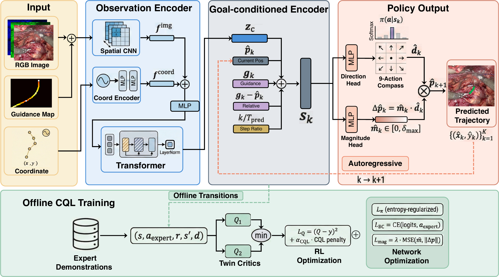

<div align="center">

<a href="https://conferences.miccai.org/2026/">
  
</a>

# SutureFormer

### Learning Surgical Trajectories via Goal-conditioned Offline RL in Pixel Space

[](https://conferences.miccai.org/2026/)
[](https://papers.miccai.org/miccai-2026/1021-Paper2703.html)
[](https://arxiv.org/abs/2603.26720)
[](LICENSE)
[](https://www.python.org/)
[](https://pytorch.org/)

</div>

Official implementation of **SutureFormer**, a surgical needle-tip trajectory prediction method.
Given variable-length observed surgical video frames with needle-tip coordinates, SutureFormer
predicts the remaining trajectory as a **goal-conditioned offline reinforcement learning** problem
in pixel space, using **CQL-Discrete** with a 3D CNN + Transformer observation encoder.



## 📢 Updates

- **[2026-07]** Official reference implementation released.
- **[Coming soon]** Surgical trajectory dataset — to be released at a later date.

## ✨ Highlights

- **Goal-conditioned offline RL in pixel space.** Trajectory prediction is cast as conservative
  offline RL (CQL-Discrete) over a discrete direction policy, rather than direct coordinate
  regression.
- **Variable-length observation encoder.** A 3D `SpatialCNN` and a causal `TemporalTransformer`
  fuse frames and needle-tip coordinates into a single context vector.
- **Decoupled action heads.** A `DirectionHead` (8-compass + idle) and a `MagnitudeHead`
  (continuous step size) predict each displacement.
- **Guidance-conditioned rollout.** Explicit goal guidance conditions every prediction step, which
  is especially helpful under sparse observations.

## 🔧 Installation

```bash
pip install -e ".[dev]"
```

Requires Python ≥ 3.10 and PyTorch ≥ 2.0 with CUDA.

## 📂 Data

The dataset will be released at a later date. In the meantime, to run the pipeline, provide data
matching the expected format:

- **Frames**: RGB PNG images, native resolution 1264 × 902.
- **Trajectory**: 9 keyframes per trajectory plus interpolated intermediate frames, each with a
  needle-tip `(x, y)` coordinate. Coordinates are normalized to `[0, 1]` internally; pixel space
  only appears at the dataset boundary.
- **Observation / prediction split**: each trajectory is split at the `obs_keyframe_end`-th
  keyframe (default 6) into a variable-length observation window and prediction horizon.
- **Patient-level split**: train/val/test are split by patient to avoid leakage; `split.py`
  documents the split logic.

Processed 4-channel crops (RGB + guidance) are cached as fp16 `.pt` files for fast loading:

```bash
python scripts/warm_cache.py                                        # default kf6
python scripts/warm_cache.py --obs_keyframe_end 3 --min_keyframes 4 # kf3
```

## 🚀 Usage

The training loop is offline (no environment interaction). Configuration is managed with
[Hydra](https://hydra.cc/); override any parameter as `key=value`.

```bash
# Train (default: obs = first 6 keyframes, predict the rest)
python train.py

# Train the kf3 setting (obs = first 3 keyframes, predict the rest)
python train.py dataset=surgical_trajectory_kf3 model=sutureformer_kf3 trainer=kf3

# Override hyperparameters
python train.py trainer.batch_size=32 model.transformer_layers=6

# Evaluate a checkpoint on the test set (Hydra)
python evaluate.py +checkpoint=path/to/best_model.pt

# Single-trajectory inference (argparse)
python inference.py --checkpoint path/to/best_model.pt --patient 021 --trajectory 402
```

## 🧠 Method

SutureFormer runs in two phases. In the **observation phase**, a 3D `SpatialCNN` encodes the
4-channel observation frames and a `CoordinateEncoder` embeds the needle-tip coordinates; their
concatenation is fused by a causal `TemporalTransformer` into a context vector `z_ctx`. In the
**prediction phase**, the model autoregressively rolls out the remaining trajectory: at each step a
`PredictionStateEncoder` combines `z_ctx`, the current position, goal guidance, the relative
displacement to the goal, and the step ratio into a state, from which a `DirectionHead` and a
`MagnitudeHead` produce the next displacement.

| Component                  | Role                                                                               |
| -------------------------- | ---------------------------------------------------------------------------------- |
| `SpatialCNN`             | 3D convolutional encoder over the 4-channel observation frames →`[B,T,256]`     |
| `CoordinateEncoder`      | sinusoidal encoding + MLP of needle-tip coordinates →`[B,T,64]`                 |
| `TemporalTransformer`    | causal self-attention over the observation window → context`z_ctx [B,256]`      |
| `PredictionStateEncoder` | fuses context, position, guidance, relative displacement, step ratio →`[B,480]` |
| `DirectionHead`          | policy head over 9 discrete directions (8-compass + idle)                          |
| `MagnitudeHead`          | supervised head for continuous step magnitude                                      |
| `QNetwork`               | discrete-action critic for CQL                                                     |

The offline CQL-Discrete training loop:

1. **Encode observations** with gradients through the CNN + coordinate encoder + transformer.
2. **Extract expert transitions** from ground-truth trajectories (discretize directions, compute
   rewards) — no environment rollout.
3. **Q-update** with the CQL conservative penalty (states detached — no encoder gradients).
4. **Policy update** via an entropy-regularized objective (backprops through the encoder).
5. **Magnitude update** via supervised MSE on the ground-truth displacement magnitude.
6. **Soft target update** via Polyak averaging.

## ⚙️ Configuration

Config files live in `configs/`:

| File                                     | Contents                                                           |
| ---------------------------------------- | ------------------------------------------------------------------ |
| `config.yaml`                          | Top-level defaults, seed, Hydra output dirs                        |
| `model/sutureformer.yaml`              | Architecture (CNN, Transformer, state dim, Q-network)              |
| `dataset/surgical_trajectory_kf6.yaml` | `obs_keyframe_end=6`, `min_keyframes=7`, paths, cache dir      |
| `dataset/surgical_trajectory_kf3.yaml` | Same but`obs_keyframe_end=3`, `min_keyframes=4`                |
| `trainer/default.yaml`                 | CQL hyperparameters, learning rates, reward, augmentation, logging |

Metrics: **ADE** (average displacement error), **FDE** (final displacement error), and **FD**
(Fréchet distance) — all in pixels, lower is better.

## 📊 Results

Quantitative comparison on the test set, as reported in the paper (pixel space, lower is better).

**Obs = 6, Pred = 3** (observe 6 annotated keyframes, predict the next 3):

| Method                        |     ADE ↓     |     FDE ↓     |      FD ↓      |
| ----------------------------- | :-------------: | :-------------: | :-------------: |
| BC                            |     128.15     |     146.24     |     156.83     |
| GAIL                          |     269.79     |     282.99     |     305.86     |
| IBC                           |     243.97     |     262.12     |     285.60     |
| iDiff-IL                      |     187.38     |     207.32     |     220.21     |
| CondDiff                      |     165.20     |     189.47     |     200.31     |
| MID                           |     151.23     |     165.24     |     192.79     |
| **SutureFormer (ours)** | **55.29** | **84.23** | **86.00** |

**Obs = 3, Pred = 6** (observe 3 keyframes, predict 6 — sparser observation):

| Method                        |     ADE ↓     |      FDE ↓      |      FD ↓      |
| ----------------------------- | :-------------: | :--------------: | :--------------: |
| BC                            |     137.06     |      184.69      |      195.13      |
| GAIL                          |     249.19     |      254.41      |      318.82      |
| IBC                           |     225.74     |      260.49      |      296.82      |
| iDiff-IL                      |     223.75     |      259.90      |      296.62      |
| CondDiff                      |     184.15     |      236.84      |      255.62      |
| MID                           |     172.67     |      229.83      |      246.65      |
| **SutureFormer (ours)** | **94.85** | **154.68** | **158.46** |

## 🐳 Docker

```bash
docker build -t sutureformer -f docker/Dockerfile .
docker compose -f docker/docker-compose.yml up
```

See `docker/README.md` for prerequisites and volume-mount details.

## 📚 Citation

If you find this work useful, please consider citing:

```bibtex
@inproceedings{liu2026sutureformer,
  title     = {{SutureFormer}: Learning Surgical Trajectories via Goal-Conditioned Offline {RL} in Pixel Space},
  author    = {Liu, Huanrong and Tian, Chunlin and Jia, Tongyu and Zhou, Tailai and Liu, Qin and Gao, Yu and Ban, Yutong and Gu, Yun and Rosman, Guy and Ma, Xin and Li, Qingbiao},
  booktitle = {Medical Image Computing and Computer Assisted Intervention -- MICCAI 2026},
  year      = {2026},
  publisher = {Springer Nature Switzerland},
  series    = {Lecture Notes in Computer Science},
  volume    = {16893},
  month     = sep,
  url       = {https://papers.miccai.org/miccai-2026/1021-Paper2703.html}
}
```

## 📄 License

Released under the [MIT License](LICENSE).